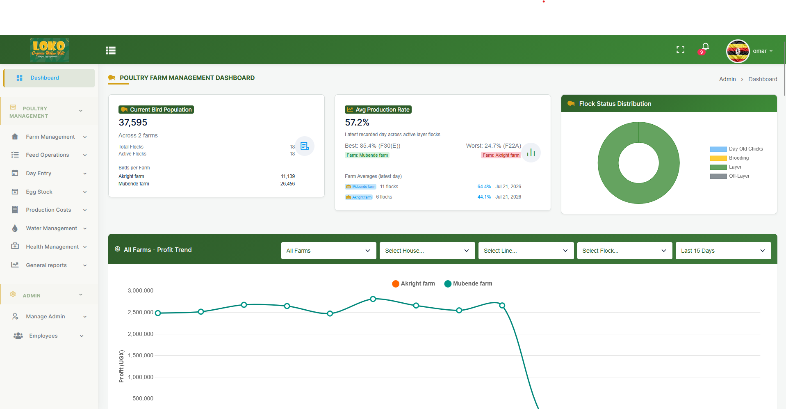
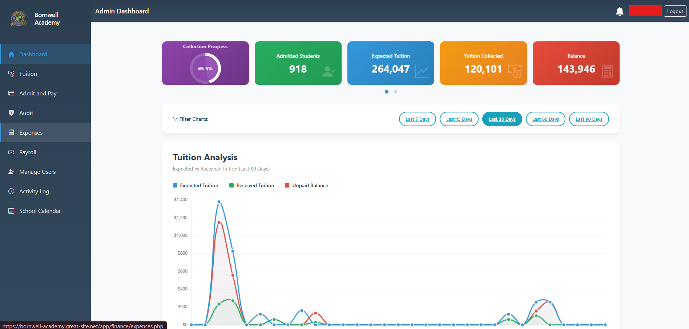
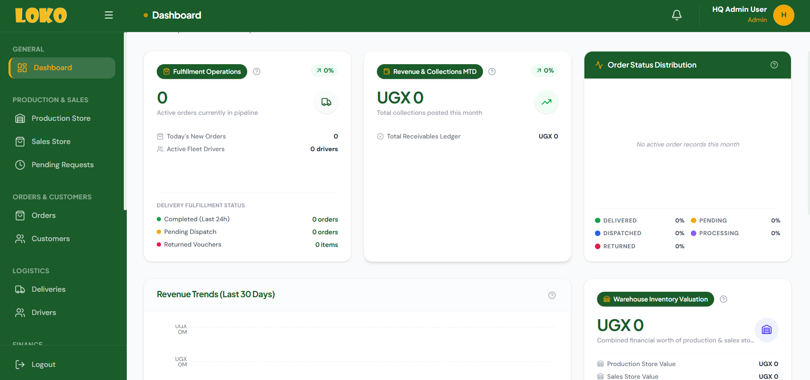
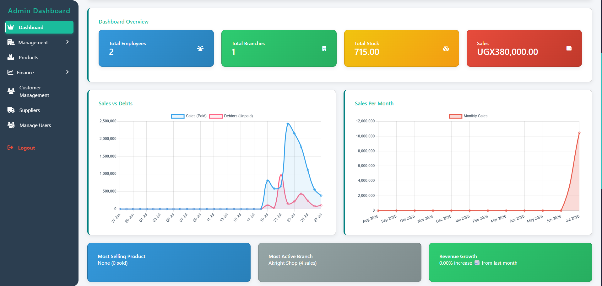

<h1 align="center">
  
</h1>

<h3 align="center">
Full Stack Software Engineer | Founder @ Skyrix Technologies | Building scalable software solutions from Uganda 🇺🇬
</h3>

 

🚀 Building **scalable enterprise applications using Laravel, Next.js, TypeScript, MySQL, and modern software architecture principles**

🌱 Currently expanding my expertise in **Docker, Cloud Infrastructure, System Design, CI/CD, Nginx, and Distributed Systems**

💼 Founder of **Skyrix Technologies**, creating software solutions for businesses, education, agriculture, finance, and retail

🏗️ Experienced in building **Business Management Systems, POS Platforms, School Management Systems, SACCO Solutions, and Agricultural Tracking Systems**

⚙️ Passionate about **backend engineering, API development, database optimization, performance tuning, and designing reliable software architectures**

💬 Ask me about **Laravel, PHP, JavaScript, TypeScript, React, Next.js, REST APIs, MySQL, System Design, and Enterprise Software Development**

⚡ I enjoy transforming complex real-world problems into elegant, scalable, and user-friendly software solutions.

 

 

<h2 align="center">⚒️ Languages • Frameworks • Tools ⚒️</h2>

 

### 💻 Programming Languages

  

### 🎨 Frontend Development

  

### ⚙️ Backend Development

  

### 🗄️ Databases

  

### ☁️ DevOps & Developer Tools

 

<h2 align="center">🚀 Featured Projects</h2>

 

<table>

<tr>

<td width="50%" align="center">

<h3>🐔 LOKO Harvest Management System</h3>

  

Enterprise agriculture management platform for operational tracking, inventory, and business reporting.

</td>

<td width="50%" align="center">

<h3>🏫 Bornwell Academy School System</h3>

  

School automation platform managing students, academics, finance, and administration.

</td>

</tr>

<tr>

<td width="50%" align="center">

<h3>📦 LOKO Orders System</h3>

  

Order management platform for processing customer orders, tracking deliveries, and streamlining business operations..

</td>

<td width="50%" align="center">

<h3>🛒 Skyrix POS System</h3>

  

Retail management system for sales, inventory control, and business analytics.

</td>

</tr>

</table>

 

 

<h2 align="center">📊 GitHub Analytics</h2>

 

  

 

<h2 align="center">🐍 Contribution Journey 🐍</h2>

 

 

<h2 align="center">📌 Current Focus</h2>

🔹 Building production-ready enterprise applications

 

🔹 Improving software architecture and scalability skills

 

🔹 Exploring cloud infrastructure and DevOps practices

 

🔹 Creating technology solutions that solve real-world problems

 

<h3>
⭐ Thanks for visiting my profile!
</h3>

Let's connect, collaborate, and build impactful software solutions together.

